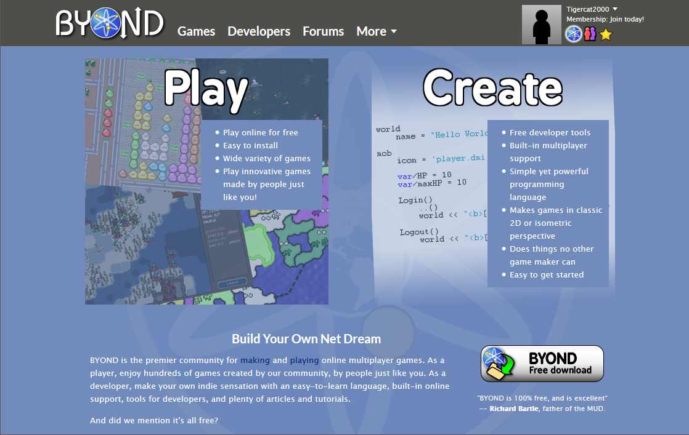
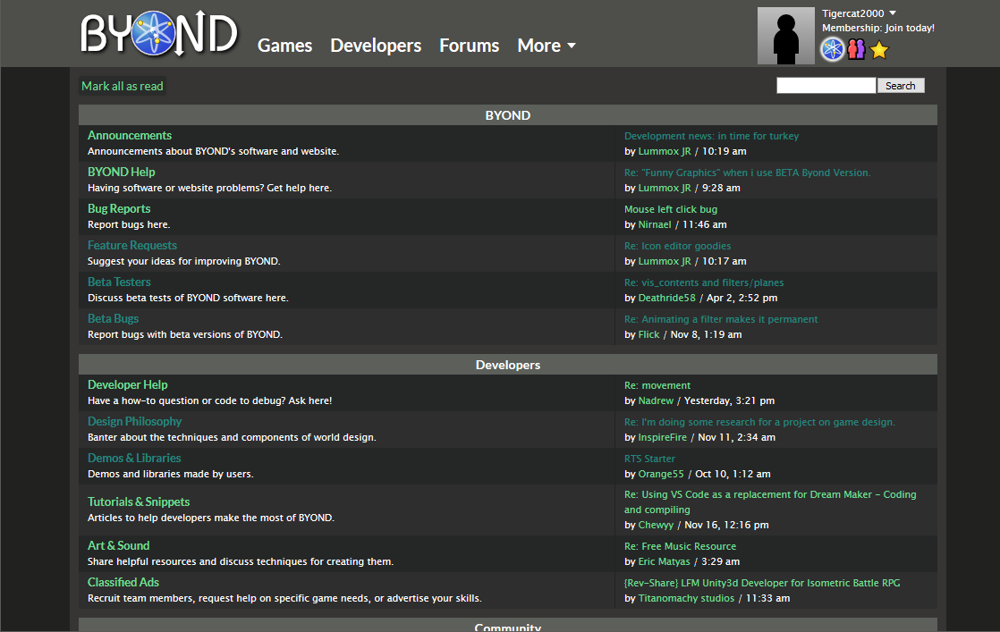

<h1 align="center">BYOND GreenDark UserCSS</h1>

  
  
  

<h2 align="center">Because BYOND's default theme makes you want to :skull::gun:</h2>

## Preview

## Installation

Install [Stylus](https://add0n.com/stylus.html) for either [Firefox](https://addons.mozilla.org/en-US/firefox/addon/styl-us/), [Chrome](https://chrome.google.com/webstore/detail/stylus/clngdbkpkpeebahjckkjfobafhncgmne) or [Opera](https://addons.opera.com/en-gb/extensions/details/stylus/) and then install the style using this link:

[UserCSS](https://tigercat2000.github.io/BYOND-GreenDark/byond-greendark.user.css)

README markdown code shamelessly stolen from [StylishThemes/GitHub-Dark](https://github.com/StylishThemes/GitHub-Dark)